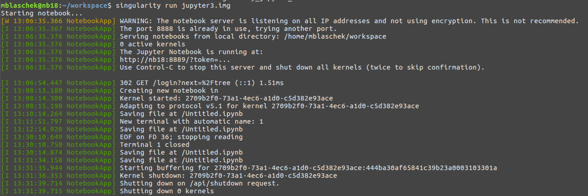
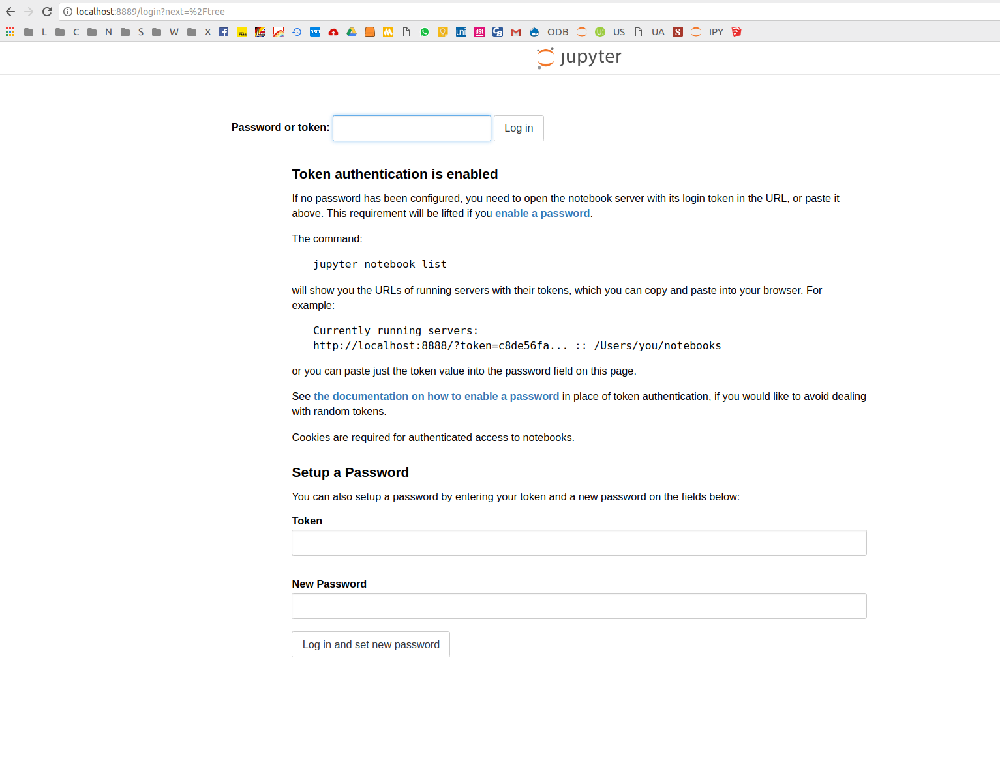

# Jupyter and Singularity

**Updated: 10.2.2019, new singularity version 3.0.1**

Jupyter Miniconda Python 3 and Singularity Container

This is an update from [](https://github.com/singularityhub/jupyter) the offical jupyter singularity container that requires root permissions to run:
* [NEW] Only need root permissions to create the container
* [NEW] Miniconda (smaller in size)

If you haven't installed singularity, do that with [these instructions](http://singularity.lbl.gov/install-linux). Then Download the repo if you haven't already:

      git clone https://github.com/MBlaschek/singularity-jupyter jupyter
      cd jupyter

It includes a line at the end that is quite important for jupyter to run:
      
      export JUPYTER_RUNTIME_DIR=$PWD/.runtime

This line tells jupyter to use a specific directory for its runtime. Otherwise it would try to use the default `XDG_RUNTIME_DIR`, which is by default set to `/run/user/...` and not accessable via the container.

## CREATE
Let's now create the notebook container:

* Jupyter Python 3 Notebook Container: `jupyter3.def` 
* Jupyter Python 2 & 3 Notebook Container: `jupyter23.def`
* Jupyter Python 2 & 3 Notebook + Eccodes Library: `jupyter_eccodes.def`(depends on the image from `jupyter23.def` = `jupyter23.sif `)

You can choose now if you prefer a writeable container (for development, installation of additional packages, ...) or a deployment container (read_only, default) [read more](http://singularity.lbl.gov/docs-build-container):

     sudo singularity build --writeable jupyter3.sif jupyter3.def

or for deployment:

     sudo singularity build jupyter3.sif jupyter3.def

## RUN
Then to run the container:

     singularity run jupyter3.sif

or for the read only version:

    singularity run jupyter3.sif

or for the writable version:

    sudo singularity run --writable jupyter3.sif

Anyway you should see output like this:



The current directory is where your server starts. In your browser you should be able to navigate to the link from the console:


The password is **super-secret**. You can change that easily within the Singularity file.

## Use your container inside an existing Jupyter Notebook Server
In order to use your container with an existing notebook server you need to register your ipykernel with that server.
Other people have done this:
* [Tensorflow](https://github.com/clemsonciti/singularity-in-jupyter-notebook)
* [Kernel](https://gist.github.com/mattpitkin/35ac19214048e96c391e948d7ec34ca5)

To register your container, in the `${HOME}/.local/share/jupyter/kernels` create a new directory, e.g. myimage, and add a `kernel.json` file containing:

```
{
 "language": "python",
 "argv": ["/usr/bin/singularity",
   "exec",
   "/dir/to/your/image/jupyter3.sif",
   "/opt/conda/bin/python",
   "-m",
   "ipykernel",
   "-f",
   "{connection_file}"
 ],
 "display_name": "Python 3 (Singularity)"
}

```
Change the path to your image. Then start a jupyter notebook with

      jupyter notebook &

and there should be a usable Python 3 (Singularity) kernel option! Check your Jupyter paths, like this:
      
      jupyter --paths
      
      config:
          /home/user/.jupyter
          /opt/anaconda2/etc/jupyter
          /usr/local/etc/jupyter
          /etc/jupyter
      data:
          /home/user/.local/share/jupyter
          /opt/anaconda2/share/jupyter
          /usr/local/share/jupyter
          /usr/share/jupyter
      runtime:
          /run/user/1000/jupyter

and make sure the runtime directory is accessable from inside the container. In this example it isn't. There I need to change this to something like this, before I run the server again:
      
      export JUPYTER_RUNTIME_DIR=$HOME/.local/share/jupyter/runtime
      jupyter notebook &

That should solve the issue and make your contained jupyter environment accessable via your notebook server. :)

#### RUNTIME DIR
I came across a few problems, which related to the `RUNTIME_DIR` and is quite import to run your server without root permissions. 
      
      XDG_RUNTIME_DIR=/run/user/1000    # Default in Ubuntu (inside the container)

That is not a good path. Therefore we change it to a defined path inside the container (already in the singularity file). 
The following shows a way around, not necessary if you use the above recipe.

This directory `/run/user/..` is not accessable by default from inside the container. 
To register your container, in the `${HOME}/.local/share/jupyter/kernels` create a new directory, e.g. myimage, and add a `kernel.json` file containing:

```
{
 "language": "python",
 "argv": ["/usr/bin/singularity",
   "exec",
   "-B",
   "/run/user:/run/user",
   "/dir/to/your/image/jupyter.img",
   "/opt/conda/bin/python",
   "-m",
   "ipykernel",
   "-f",
   "{connection_file}"
 ],
 "display_name": "Python 3 (Singularity)"
}

```
where adding the `-B /run/user:/run/user` option is important, which allows the container to have access.
